# Gun Violence in the US

## Overview
This project utilized a dataset of gun violence incidents in the US from 2013-2018. The data was compiled by a Kaggle user and collected from the Gun Violence Archive (GVA), a non-profit corporation formed in 2013 to provide free online public access to accurate information about gun-related violence in the US. Using this data, the following questions were posed:

#### Framing Questions
1. Visualization-based:   
	- What is the distribution of shootings by political district?
	- What is the breakdown of gender in the shootings?
	- What is the proportion of solo vs. group killings?
	- What is the distribution of gun type used?
2. Machine Learning based:
	- Can the gun acquisition method be determined based upon suspect/incident features?
	- How about for predicting the outcome of each suspect?
	- Using characteristics of the suspect, can the number of fatalities be predicted?
	- Is there a way to use the incident characteristics notes to predict the severity of the shooting, measured by the number of fatalities and injuries?

## Resources
Software:
- Anaconda 4.7.12
- Python 3.7.4
- Pandas 1.0.0
- Numpy 1.18.1
- Matplotlib 3.1.3
- Sqlalchemy 1.3.13
- Sklearn 0.22.1
- Imblearn 0.6.1
- Tensorflow 2.0.0
- Pyspark 2.4.5
*see `Requirements.txt` for complete list*

Data Source:
- https://www.kaggle.com/jameslko/gun-violence-data

Data Presentation:
- **Google Doc**: https://docs.google.com/document/d/19m0oNe3mf9ttQIJ13VabIjzqJg0Vyj_xbIgDMrLssVY/edit?usp=sharing
- **Google Slides**: https://docs.google.com/presentation/d/1nkW3fpefR0DPcBrYFjR-200SU31aRVqt7BEz9DwdAI0/edit?usp=sharing
- **Presentation Notes**: https://docs.google.com/document/d/1PyUwVCS-hTZXH9TQlr-Ge9XSyQgzxefLwrRM2xq6ZGQ/edit?usp=sharing
- **Dashboard**: *tbd*

## Summary

#### Data Exploration
Started by importing dataset from Kaggle website into a Pandas DataFrame in Jupyter Notebook. From there, relevant columns were selected and their datatypes converted to reflect their content (*eg. 'date' column was converted to `datetime`*). Next, three distinct DataFrames were created from the original import; one for all incident-related columns, one for suspect-specific columns, and finally one for the guns used. The format of the original dataset had multiple data points within a single row for some columns (*eg. 'participant_status' column had entries such as `0::Injured||1::Injured||2::Injured||3::Injured`*). These columns were exploded within each DataFrame so that every row had only a single data point. Finally each of the three DataFrames was uploaded to an AWS PostgreSQL database. 

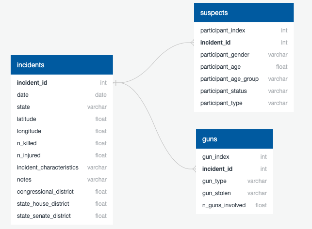

*see `ETL/` for more detail*

#### Preliminary Analysis
Pandas and python were used to perform some preliminary analysis on the dataframes. In looking at the demographic profile of the shooters, most were male, young adults, and in their early 20's. States with the most shootings also have major urban centers with large populations, and the majority of the shootings committed in those states involved stolen guns. 
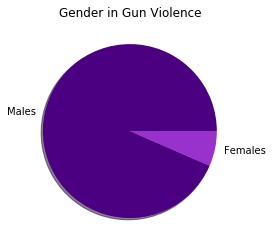
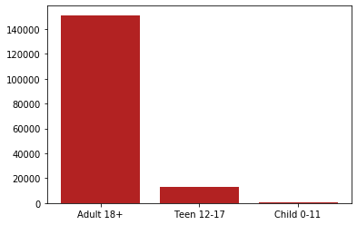
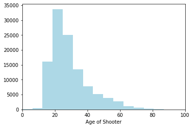
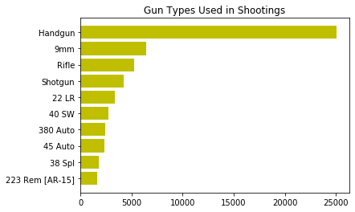
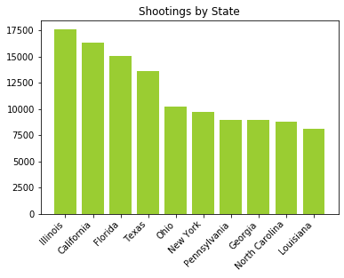

#### Interactive Map
The the top 50 entries ordered by the number of casualties were taken from the incidents dataframe and transformed into a geojson file in python. This was then exported to the Maps folder to create a geojson object. Javascript, html, and css were used to read the geojson object and create an interactive map on a local server. Circle marker size on the map corresponds to the number of casualties. The dataframe size was cut down for time and to reduce crowding on the map.
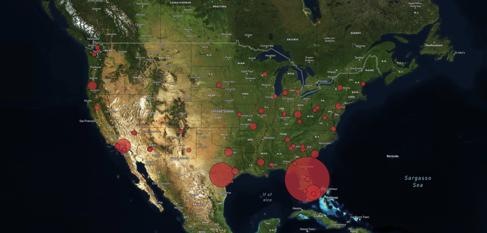

#### Predictive Models
All questions being posed for prediction are classification based. The gun acquisition problem required a binary classifier while the rest were multi-class classifiers. The non-NLP (Natural Language Processing) problems each explored the performance of 4 different algorithms; Logistic Regression, State Vector Machine (SVM), Random Forest Classifier, and a Deep Neural Network (DNN). The NLP problems used a Naive Bayes model which excels at text classification with the many different features (words). 

Gun Acquisition Accuracy								 |	Suspect Outcome Accuracy
:-------------------------------------------------------:|:-----------------------------:
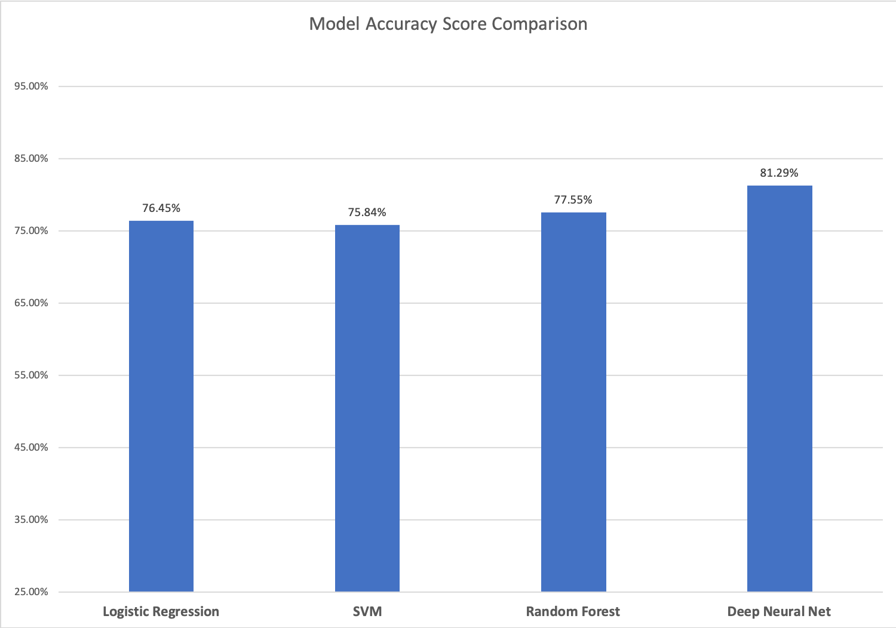 | 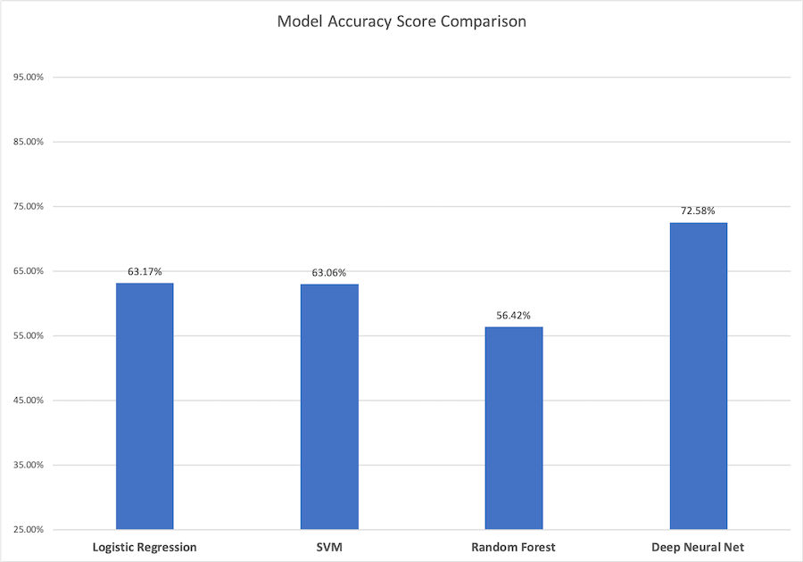

Suspect Fatalities Accuracy								 	|	NLP Accuracy
:----------------------------------------------------------:|:-----------------------------:
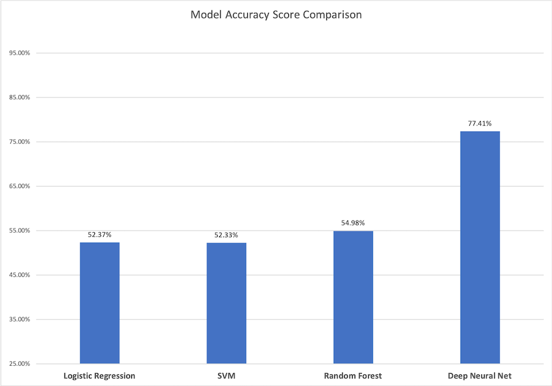 | 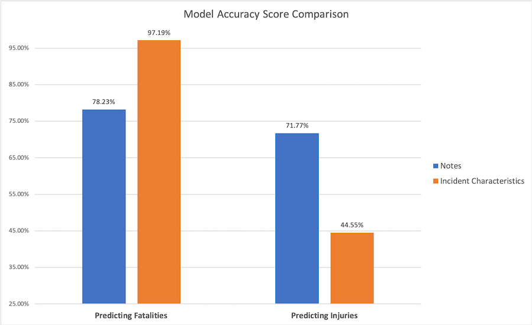

*see `Machine Learning/` for more detail*